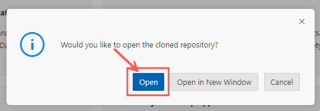
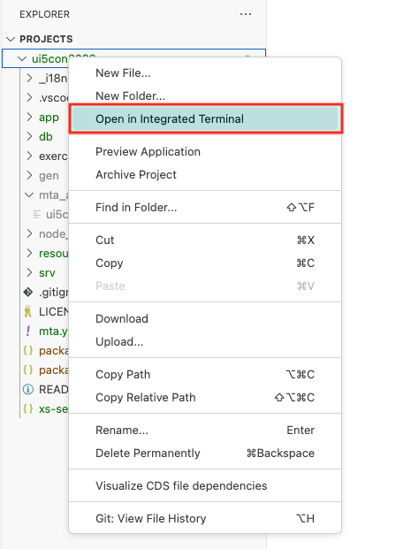

# Getting Started - Setting up your Development Environment

If you don't have an **SAP BTP trial account** already, see this [tutorial](https://developers.sap.com/tutorials/hcp-create-trial-account.html).\
After activation, or if you already had an SAP account, go to the SAP [BTP Trial page](https://account.hanatrial.ondemand.com/) and click **Log On**.

## Setting Up SAP Business Application Studio

Depending on when you created the SAP BTP Trial account, the subscription to **SAP Business Application Studio** might already be added in the subaccount.\
If you are not subscribed to SAP Business Application Studio, follow [this step](https://developers.sap.com/tutorials/appstudio-onboarding.html#005500bf-bf4a-44cb-bbef-f2221d061b5c) to add the subscription to your subaccount.

## Accessing SAP Business Application Studio

On the **Welcome** screen, Click on the Quick Tool Access icon **SAP Business Application Studio**.


## Creating the Development Space

Click on the button **Create Dev Space**.


Enter a name for your development space and select application profile **Full Stack Cloud Application**.


In the lower right corner of the page press button **Create Dev Space**.

<br>

Once your development space has status running, click on the development space name to open it.


## Getting the Sample Scenario

Get the GitHub repository clone Https Url from the repository's [landing page](https://github.com/c-kobo/ui5con2023).\
Click on button **Code**, then click the copy icon.


In the dev space, we will see a **Welcome Page**.\
Click on tile **Clone from Git**.


Alternatively, you can go via menu **View->Find Command...** and search for command **git clone**.


Paste the repository link into the input field.

```abap
https://github.com/c-kobo/ui5con2023.git
```


If asked, select repository location.


When the cloning is finished, open the cloned repository.



Alternatively, you can open a workspace via the file menu.


Select folder path **/home/user/projects/ui5con2023/** and click **Ok**. This will restart SAP Business Application Studio.


In the **Explorer** pane on the left side of SAP Business Application Studio, you should see the workspace content.


Open a terminal window from the root of your CAP project, right-click your project and select `Open in Integrated Terminal`;


Run the command to install the node dependencies;

```bash
npm i
```

## Summary

With the setup procedure done, you now have completed:

- Setting up the SAP Business Technology Platform trial account
- Access to SAP Business Application Studio
- Creation of your development space
- Setting up the sample OData V4 service in SAP Business Application Studio

Continue to - [Exercise 1 - Generating an SAP Fiori Elements App](../ex1/README.md)
