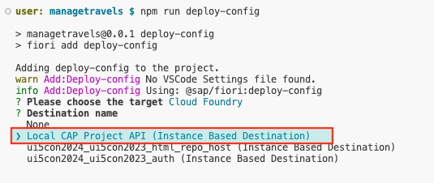
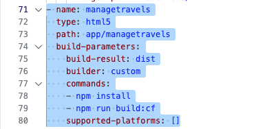

# Exercise 10 - Add Fiori UI application to MTA Configuration

In this exercise the Fiori UI that was generated using the CAP travel service will be added to the Multi Target Application (MTA) configuration.

## Exercise 10.1 - Add Fiori UI Deployment Configuration

(1) Open a terminal window, expand `app` and right-click your Fiori UI project `managetravels`, select `Open in Integrated Terminal`;


(2) We are now going to run a CLI wizard to generate the deployment configuration for the HTML5 Fiori UI application, ensure to select `Cloud Foundry` as the `target` environment;
```bash
npm run deploy-config
```


(3) Select `Local CAP Project API (Instance Based Destination`;

Where did this destination come from? When you run the npm command `deploy-config` it detects the presence of the `mta.yaml` which is also missing a local destination instance to allow communication between the Fiori UI and the CAP project when deployed to Cloud Foundry.



(4) Since you are changing the contents of the `./mta.yaml`, you are prompted to confirm these changes, enter `Y`;


## Exercise 10.2 - Review Changes

The following changes were made to your Fiori UI application;

* a new file `./app/managetravels/xs-app.json` was added to support the OData routing when deployed to Cloud Foundry
* `./app/managetravels/package.json` was updated with additional Cloud Foundry scripts, for example `build:cf`
* `./app/managetravels/webapp/manifest.json` was updated with the `sap.cloud` to support binding to the managed approuter when deployed to Cloud Foundry, this is to support routing of HTTP requests

(5) The following changes were made to your CAP application;

* `./package.json` was updated additional build, deploy and undeploy scripts
* `./mta.yaml` was updated to support the deployment of the Fiori UI Travel application



Open `./mta.yaml` and notice the `html5` module contains a number of commands, one of these is `build:cf` which ensures the Fiori UI application is built for Cloud Foundry when building and deploying your CAP project to Cloud Foundry.

## Summary

You've now successfully added deployment configuration to the Fiori UI application and updated the `mta.yaml` to append the application when buidling and deploying to Cloud Foundry.

Continue to - [Exercise 11 - Deploy to Cloud Foundry](../ex11/README.md)

