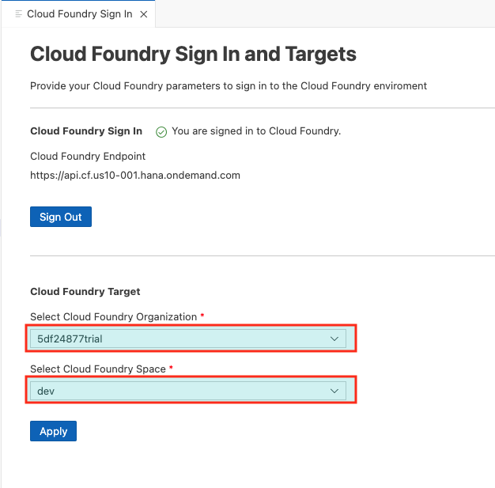

# Exercise 11 - Deploy to Cloud Foundry

In this exercise you will deploy the generated mtar archive to Cloud Foundry with a SAP HANA database.

# Prerequisites

* You are subscribed to the [Launchpad Service](https://developers.sap.com/tutorials/cp-portal-cloud-foundry-getting-started.html) to allow HTML5 applications to be hosted on Cloud Foundry
* You are subscribed to SAP HANA Cloud trial service, refer to this [tutorial](https://developers.sap.com/tutorials/hana-cloud-mission-trial-2.html)
* You have provisioned an instance of SAP HANA Cloud and bound the SAP HANA database to your `space`, refer to this [tutorial](https://developers.sap.com/tutorials/hana-cloud-mission-trial-8.html)
* SAP HANA Cloud database is set up and running in your SAP BTP space, which can be found under  `Subaccount` -> `Overview` tab -> `Spaces` and selecting your space, then selecting `SAP HANA Cloud` as shown in the screenshot


## Exercise 11.1 - Login to Cloud Foundry

(1) From the left navigation bar, select `View`, `Command Palette`, `CF: Login to Cloud Foundry` and select authentication method that best suits you;


(2) Select your Cloud Foundry organization and space, the default options should be set unless you are running multiple dev spaces;



## Exercise 11.2 - Option 1 - Build and Deploy using CLI

(3) Open a terminal window, from the root of your CAP project, right-click your project and select `Open in Integrated Terminal`;


(4) The `./package.json` was updated with build and deploy scripts during exercise 9, for example;

```json
"undeploy": "cf undeploy ui5con2023 --delete-services --delete-service-keys --delete-service-brokers",
"build": "rimraf resources mta_archives && mbt build --mtar archive",
"deploy": "cf deploy mta_archives/archive.mtar --retries 1"
```

In the new terminal window, run the `build` command;

```bash
npm run build
```


(5) A new `mtar` archive is generated in the `mta_archives` folder `./mta_archives/archive.mtar`. To deploy to Cloud Foundry, run the command;

```bash
npm run deploy
```


## Exercise 11.2 - Option 2 - Build and Deploy using Project Explorer

(6) Right click `./mta.yaml` and select `Build MTA Project`;


(7) A new `mtar` archive is generated in the `mta_archives` folder. Right-click the newly generated `mtar` archive and select `Deploy MTA Archive`;

__Note:__ Deployment will fail if the SAP HANA database in your cloud space is not started!


All going well, your CAP project with a Fiori UI application should be deployed to Cloud Foundry.

## Exercise 11.3 - Retrieve Deployed Application

(8) To get a list of deployed HTML5 applications, run the following command;

```bash
cf html5-list -di ui5con2023-destination-service -u -rt launchpad
```


This will return a list of deployed apps and the URL they are being hosted against. Press [CTRL] and click the app’s link in the terminal to open the URL in a new browser tab.

To find out more about this `html5-list` option, run the command;

```bash
cf help html5-list
```

Another option is via SAP BTP Cockpit and selecting `HTML5 Applications` then selecting your newly deployed application;


## Summary

You've now successfully deploy your CAP project with a Fiori UI application to Cloud Foundry.

For a working example, check out this [git sample repo](https://github.com/SAP-samples/fiori-tools-samples/tree/main/cap/cap-fiori-mta).

