# Exercise 3 - Improve Page Layout and add UI5 Freestyle Controls

In this exercise we will improve the page layout and add features like a dynamic page title with snapped header content showing the filter status as it is known from the standard List Report floorplan.\
In order to adopt a custom design proposal, we will then add a tile slider showing open travels with a high total price.


## Exercise 3.1 - Adopt Dynamic Page Layout to the Main Page

(1) Open the [filter bar sample](https://ui5.sap.com/test-resources/sap/fe/core/fpmExplorer/index.html#/buildingBlocks/filterBar/filterBarDefault) in the Flexible Programming Model Explorer

The sample shows the filter bar building block in a dynamic page layout.\
(2) Click the **Collapse Header** icon  to see the filter status.


Take a look at the code pane on the right side.

(3) The filter bar status is defined in the snapped content of the dynamic page title with a declarative binding to property **fbConditions>/filterTextInfo**.

(4) The Filter bar building block is defined in the dynamic page header.


We apply the adopted code snippet to our main view.
Switch back to the Business Application Studio and open file **app/managetravels/webapp/ext/main/Main.view.xml**.

(5) Add a declaration to the **sap.f** library to the header:
```xml
xmlns:f="sap.f"
```

(6) Replace the whole **\<Page\>** section with the adopted code snippet:

```xml
    <f:DynamicPage id="Main" class="sapUiResponsiveContentPadding">
        <f:title>
            <f:DynamicPageTitle id="_IDGenDynamicPageTitle1">
                <f:heading>
                    <Title id="_IDGenTitle1" text="Travel" level="H2" />
                </f:heading>
                <f:snappedContent>
                    <Panel id="pn1" headerText="{i18n>FilterStatus}">
                        <Text text="{fbConditions>/filtersTextInfo}" class="sapUiTinyMargin" />
                    </Panel>
                </f:snappedContent>
            </f:DynamicPageTitle>
        </f:title>
        <f:header>
            <f:DynamicPageHeader id="_IDGenDynamicPageHeader1" pinnable="true">
                <VBox id="_IDGenVBox1">
                    <macros:FilterBar 
                        metaPath="@com.sap.vocabularies.UI.v1.SelectionFields" 
                        id="FilterBar" 
                        filterChanged=".onFiltersChanged" />
                </VBox>
            </f:DynamicPageHeader>
        </f:header>
        <f:content>
            <macros:Table 
            id="myTable" 
            filterBar="FilterBar"
            readOnly="true"
            metaPath="@com.sap.vocabularies.UI.v1.LineItem" />
        </f:content>
    </f:DynamicPage>
```

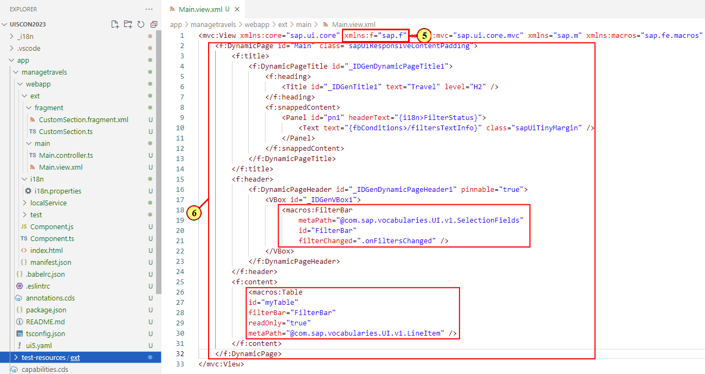

Please note that the table building block is located in the dynamic page content section.

## Exercise 3.2 Add Controller Functions for Setting Filter Status

We now need to add some controller code for setting the filter status value and for the filter changed event handler.

(7) Open file **app/managetravels/webapp/est/main/Main.controller.ts**

(8) Add 
```ts 
import JSONModel from 'sap/ui/model/json/JSONModel';
import Event from 'sap/ui/base/Event';
``` 
to the import section.

(9) Replace function **onAfterRendering** with the following code snippet. The function creates a JSONModel with property **filtersTextInfo** (and some others needed for the sample).\
The value is retrieved by FilterBar API function **getActiveFiltersText()**.\
Method **triggerSearch** makes sure that load is triggered on start of the app.

```ts
    public onAfterRendering(): void {
        const filterBar = this.byId("FilterBar") as FilterBar,
        view = this.getView(),
        mFBConditions = new JSONModel({
            filtersTextInfo: filterBar.getActiveFiltersText()
        });
        if (view) {
            view.setModel(mFBConditions, "fbConditions");  
        };
        filterBar.triggerSearch();
    }
```
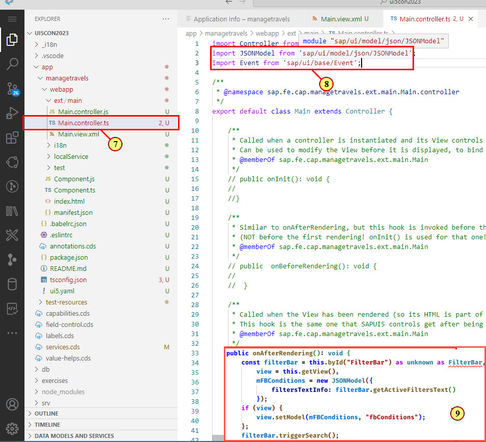

(10) Hover over the red underlined syntax highlight.

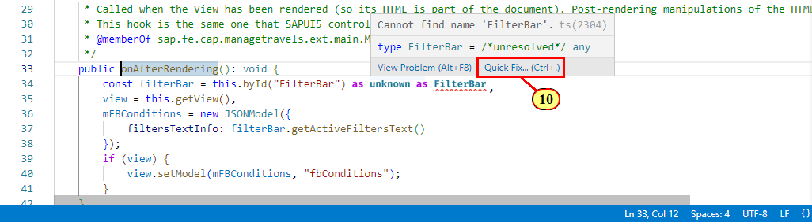.

(11) Add the corresponding import statement for the missing FilterBar type from **sap/fe/macros/filterBar/FilterBarAPI** via the proposed quick fix.

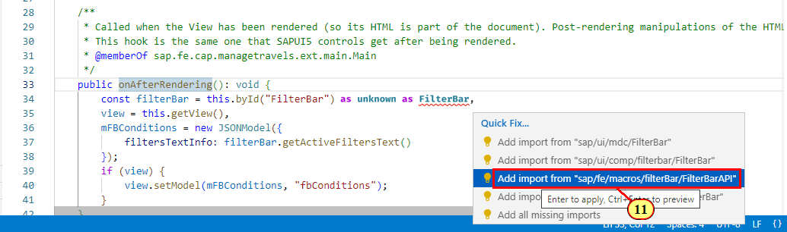

(12) The import statement is added at the top of the file.

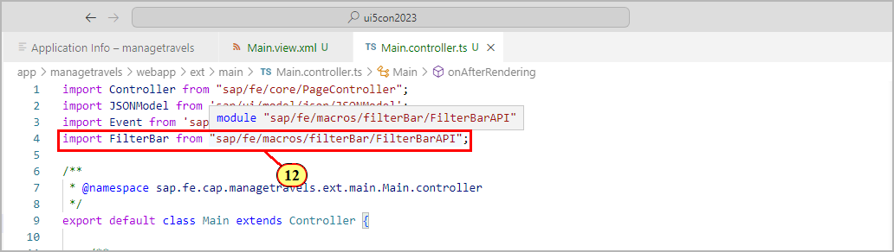

(13) Add the following handler function **onFiltersChanged** as shown in the screenshot below. In the handler function, property **filterTextInfo** is set every time the filter has been changed.
```ts
    public onFiltersChanged(event: Event) : void {
        const filterBar = event.getSource() as FilterBar;
            const mFBConditions = filterBar.getModel("fbConditions");
            if (mFBConditions instanceof JSONModel) {
                mFBConditions.setProperty("/filtersTextInfo", filterBar.getActiveFiltersText());
            }
    }        
```
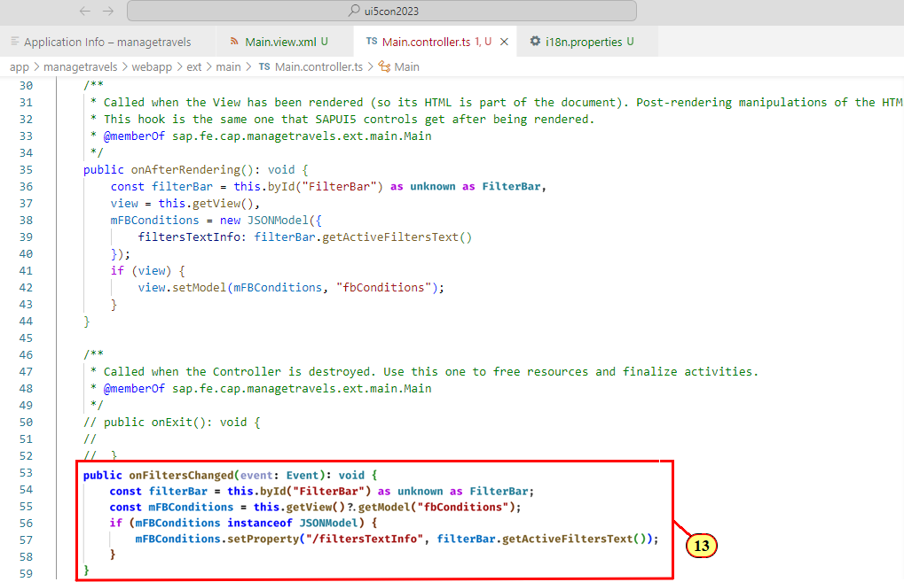

Switch to the preview browser tab.

(14) Click Collapse Header Icon .

(15) The filter status is shown in the snapped header area.

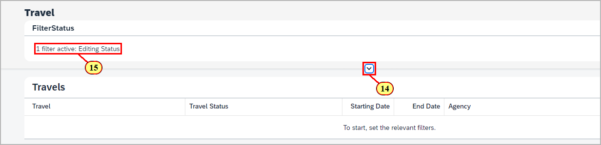

## Exercise 3.3 - Add Generic Tile Slider

The target design of the app sketches an overview on open travels with a high total price in form of a tile slider in the custom page snapped header area. While this could be as well achieved by defining multiple tab views with a selection variant on a standard list report (and it is recommended to always evaluate what can be achieved with the standard means Fiori elements offers), customers might prefer an alternative design approach to meet their requirements, which can be achieved with the Flexible Programming Model.

(16) Open the [Custom Page Sample](https://ui5.sap.com/test-resources/sap/fe/core/fpmExplorer/index.html#/customElements/customElementsOverview/customPageContent) in the **Flexible Programming Model Explorer**.

(17) Click on a tile to navigate to a Fiori elements object page.


(18) Select **CustomPage.view.xml** in the code pane. It shows the GenericTile definition with declarative property binding and a press handler.


Switch back to the Application Studio.\
(19) Open file **app/managetravels/webapp/i18n.properties** and add the following text keys :

```js
HighestPrice=Open Travels Highest Total Price (Thousands)

FilterStatus=Table Filter Status
```
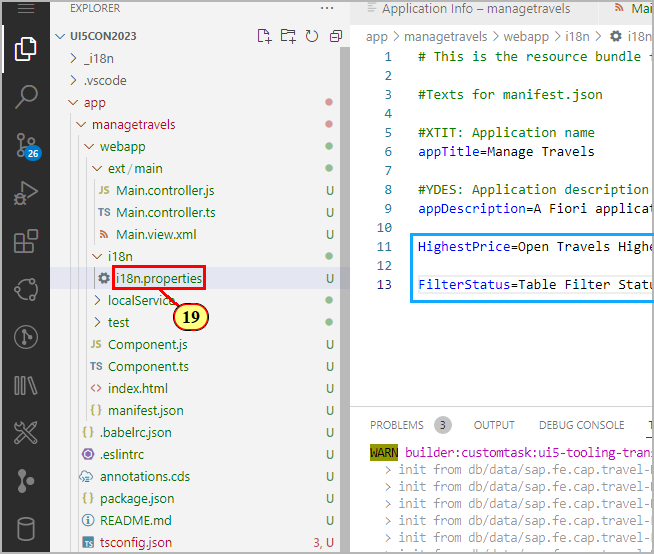

(20) Switch to file **Main.view.xml**. Replace the code in **\<f:snappedContent\>** with the following:

```xml
    <Panel id='pn1' headerText='{i18n>HighestPrice}'>
        <VBox id='vb1'>
            <HeaderContainer scrollStep="200" showDividers="false" id="container1" content="{
                path:'/Travel', 
                parameters : {
                    $filter : 'TravelStatus_code eq \'O\' and IsActiveEntity eq false or SiblingEntity/IsActiveEntity eq null',
                    $orderby : 'TotalPrice desc'
                }
            }">
                <GenericTile id='gt1' header="Travel {TravelID}" subheader="{Description}" press=".onPressed" class="sapUiTinyMarginTop tileLayout">
                    <TileContent id='tc1' unit="{CurrencyCode_code}" footer="{to_Customer/LastName}">
                        <NumericContent id='nc1' withMargin="false" value="{TotalPrice}" valueColor="Good" scale="k" />
                    </TileContent>
                </GenericTile>
            </HeaderContainer>
        </VBox>
    </Panel>
    <Panel id='pn2' headerText="{i18n>FilterStatus}">
        <Text id='filterInfo1' text="{fbConditions>/filtersTextInfo}" class="sapUiTinyMargin" />
    </Panel>
```
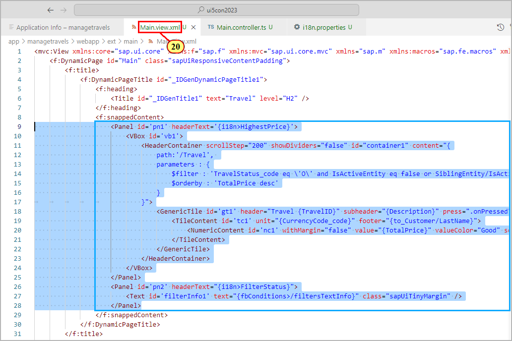

Please note the filter parameter operating on the draft administrative properties. This will make sure that values are updated from draft instances every time a travel is edited on the object page.

(21) Switch to file **Main.controller.ts**

(22) Add the handler function for the **onPressed** event defined for control **GenericTile**. Please note how navigation is triggered via the **routing extension API** by simply passing the binding context (which is set to entity **Travel**) to function **navigate**.

```ts
    public onPressed(event: Event) : void {
        const oContext = (event.getSource() as GenericTile).getBindingContext();
        if (oContext) {
            const routing = this.getExtensionAPI().getRouting();
            routing.navigate(oContext as Context);
        }
    } 
```
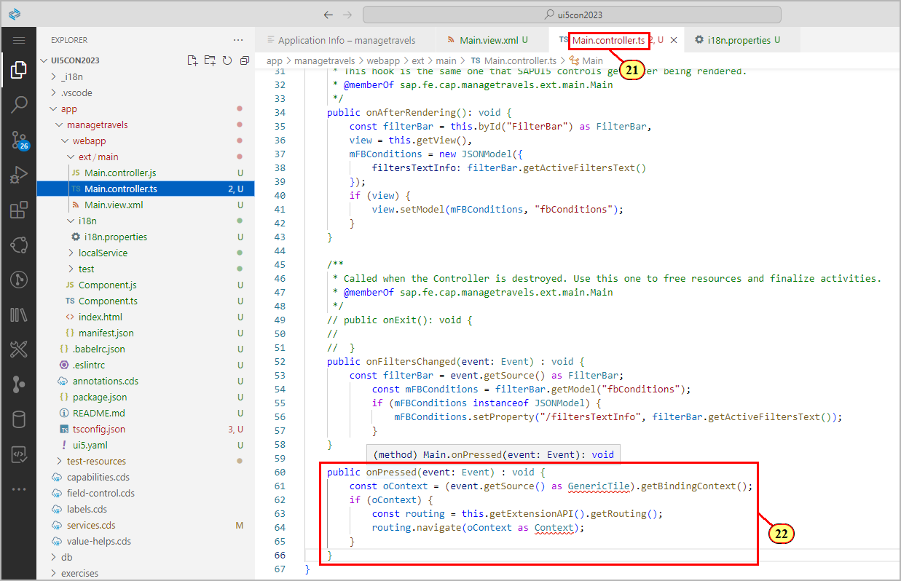

(23) Let's fix some TypeScript ESLint issues. Hover the mouse cursor over the syntax highlighted at **GenericTile** and click on **Quick Fix...**.

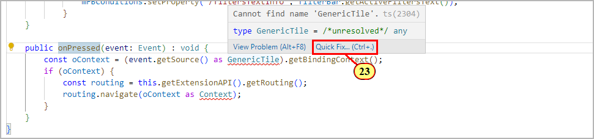

(24) Select 

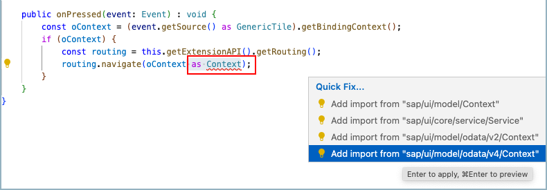

Apply another quick fix on the ESLint issue shown for **Context**
by adding a type import from **sap/ui/model/odata/v4/Context**.


Switch to the app preview browser tab and refresh. 

(25) Click the collapse header icon  or scroll the table to show the tiles. 

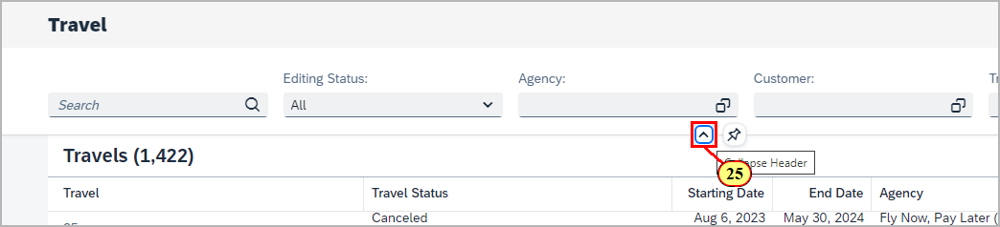

(26) Click on a tile to navigate to the object page.

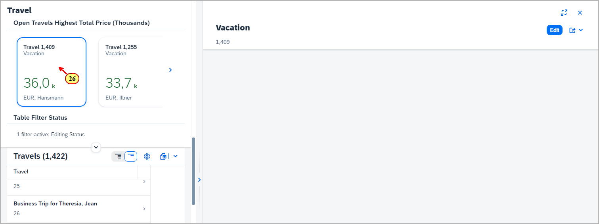

## Summary

You've now successfully adopted dynamic page layout to your main view and added filter status text and a tile slider to the snapped header area.

Continue to - [Exercise 4 - Page Map: Configuring the Object Page Layout](../ex4/README.md)
