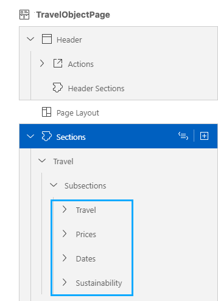

# Exercise 4 - Page Map: Configuring the Object Page Layout 

In this exercise we will configure the object page layout by using the Fiori tools Page Map.

## Exercise 4.1 - Add Actions to Object Page Header

(1) In the Application Studio toolbar, click the SAP Fiori icon .

(2) Click icon **Open Application Information** .

(3) Click on tile **Open Page Map**.

(4) Open the object page configuration by clicking button **Configure Page** .

We start by defining some actions in the object page header.

(5) Click **Add Actions** .

(6) In the **Add Actions** dialog, open the drop-down and (7) select actions **AcceptTravel** and **RejectTravel**.

(7) confirm by clicking .

Define a text to be displayed as an action button label by entering (8) **Accept Travel** and (9) **Reject Travel**. 

(10) Click icon **Create missing i18n references** to create the corresponding text keys.

(11) Confirm by clicking button . The whole project is scanned for missing text key references.

The popover informs about the number of missing text keys that were created.

## Exercise 4.2 - Adding Group and Form Sections

In this exercise we will add a group section and several form sub sections. 

(12) Click on **Add Sections** \
(13) Select 

(14) In the **Add Group Section** dialog, enter label **Travel** and create the corresponding text key reference by clicking on .

(15) Confirm by clicking .

(16) Click .

(17) Expand section **Travel** by clicking .

(18) Click **Add Sections**  to add a sub section.

(19) Select .

(20) Enter label **Travel** and click .

(21) Click .

(22) Click .

(23) (24) Expand the sub section hierarchy.\
(25) Click \
(26) Select 

(27) In the **Add Basic Fields** dialog, open the drop-down and select **TravelID**.\
You can use the input field for filtering the available properties.\

(28) Select .

(29) Select . Make sure to choose that referential constraint property and not the navigaton property **to_Agency/AgencyID**.

(30) Select .

(31) Select .

(32) To collapse the drop-down, click somewhere in the dialog .

(33) Click .

(34) (35) Repeat the steps to add  additonal **Form** sub sections **Prices**, **Dates** and **Sustainability**:

Add the following properties to the sub sections:

|     Sub Section             |     Property                
|-----------------------------|-----------------------------
|     Prices                  |     
|                             |     BookingFee                            
|                             |     TotalPrice
|     Dates                   |
|                             |     BeginDate
|                             |     EndDate
|     Sustainability          |
|                             |     GoGreen
|                             |     GreenFee
|                             |     TreesPlanted

Swich to the preview browser tab.\
(36) Select one travel to open the object page .

The Travel tiles show travels with status **open**.\

(37) Click button  to change the travel status.\
A side effect defined on the action in file **app/field-control.cds** [line 18 ff.](/app/field-control.cds#18) makes sure that the Travel entity is refreshed when the action is executed. With the status changed, the tiles are refreshed, and the current selected Travel tile dissappears.\

For more information about side effects, please check the guide [Usage of Side Effects](https://sapui5.hana.ondemand.com/test-resources/sap/fe/core/fpmExplorer/index.html#/advancedFeatures/guidance/guidanceSideEffects).

(38) Select another travel.

(39) Click .

(40) Select the **Trees-4-Tickets** checkbox on the right-hand side.\

For a sustainability initiative, the travel service provides some fields for a new green flight offering.\
When the checkbox is selected, an info popover is shown (41), and the service backend calculates the values for properties **Green Flight Fee**,**Trees Planted**, and **Total Price**.\
The values shown on the UI are automatically updated by another side effect on property **GoGreen** of entity **Travel**
defined in file **app/field-control.cds** [line 37 ff.](/app/field-control.cds#37)

## Summary

You've now successfully configured the object page layout by adding group section and sub sections by making usage of the Page Map.

Continue to - [Exercise 5 - Adding a Custom Section](../ex5/README.md)