# Exercise 5 - Flexible Programming Model: Extending the Object Page with a Custom Section and a Building Block

In this exercise, we will combine a UI5 freestyle control with building block table in a custom section.

## Exercise 5.1 Add LineItem annotation via LSP Support

In exercise 2 we have learned how to use guided development in order to add a building block to a page.
We will now use CAP CDS LSP support to define the UI.LineItem annotation, and then use the UI5 language assistant to add building block table to a custom section XML fragment.

(1) In the app studio open file 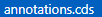.

Add a UI.LineItem annotation at the the end of the file.
You can use the CAP CDS LSP support for annotation modelling by pressing keys ctrl+space (Mac OS: cmd+space) and filter the available LSP menu entries (choose DataField annotations).
Try to create the annotation as shown below, or alternatively just copy over the annotation snippet:

```ts
annotate service.Booking with @(
    UI.LineItem : [
        {
            $Type : 'UI.DataField',
            Value : to_Carrier.AirlinePicURL,
            Label : 'AirlinePicURL',
        },
        {
            $Type : 'UI.DataField',
            Value : BookingID,
        },      
        {
            $Type : 'UI.DataField',
            Value : to_Customer_CustomerID,
        },{
            $Type : 'UI.DataField',
            Value : to_Carrier_AirlineID,
        },{
            $Type : 'UI.DataField',
            Value : ConnectionID,
        },{
            $Type : 'UI.DataField',
            Value : FlightDate,
        },{
            $Type : 'UI.DataField',
            Value : FlightPrice,
        },
        {
            $Type : 'UI.DataField',
            Value : BookingStatus_code,
        },]
);
``` 
(2) The inserted annotation should be located as shown below:

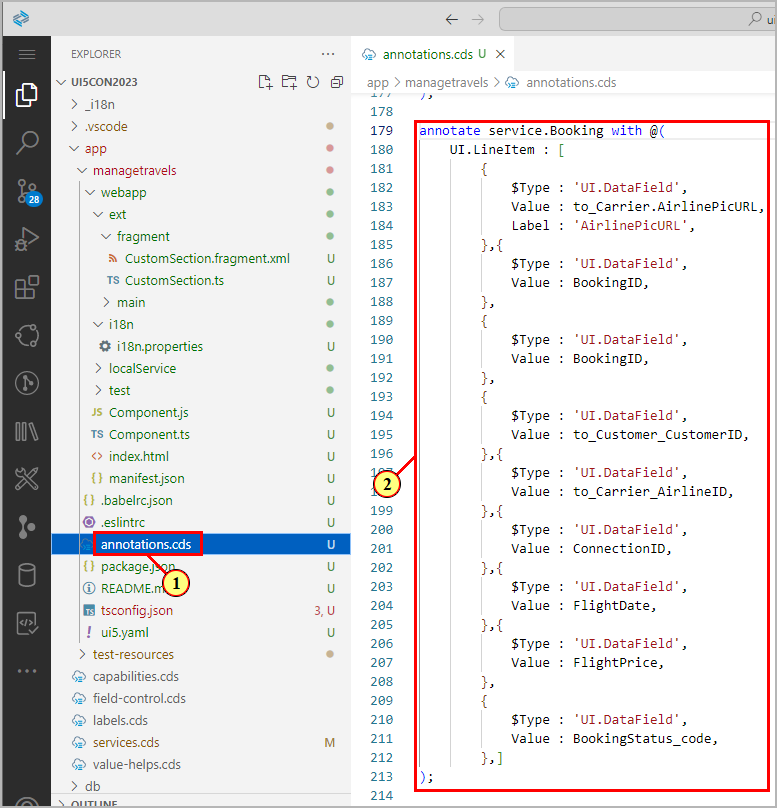

## Exercise 5.2 Add Custom Section

(3) Open the **Page Map** via the **Application Information** tab.

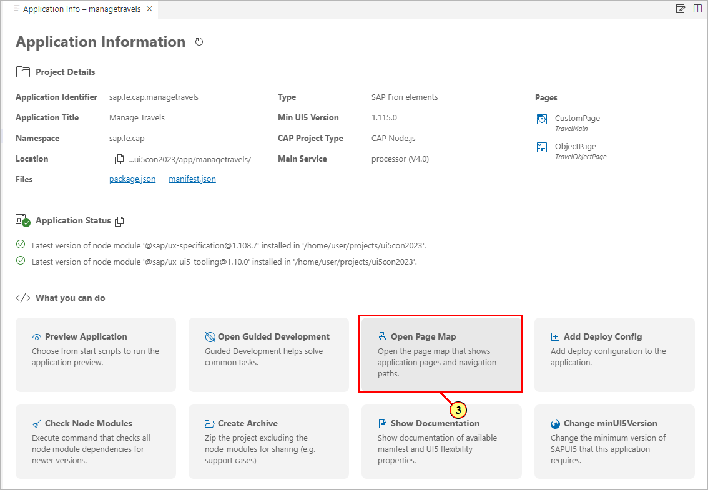

Navigate to the object page.

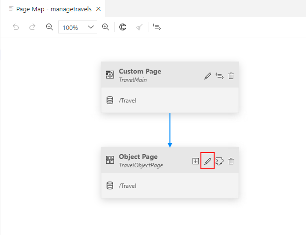

(4) In the Page Editor, click  in the top right corner of area **Sections**.

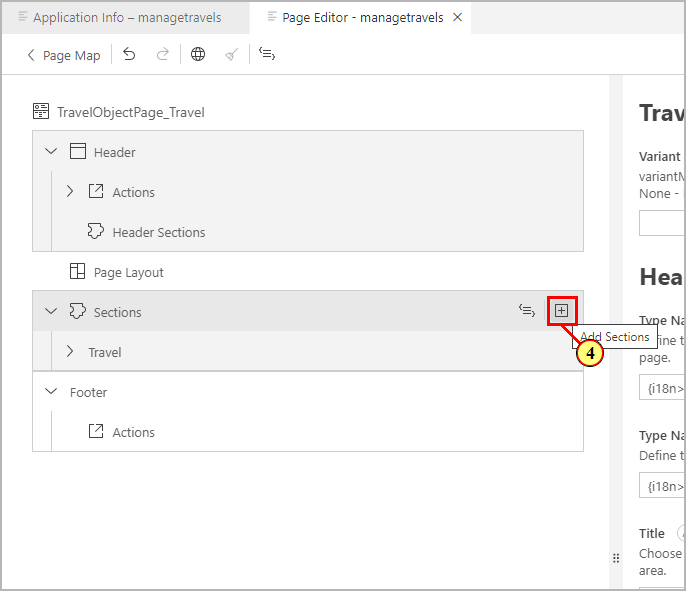

(5) In the combo box, select .

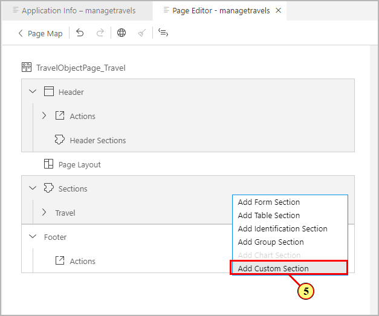
In the dialog **Add Custom Section**, enter **My Itinerary** as title.\
(6) On the right end of the **Title** input field, click icon .

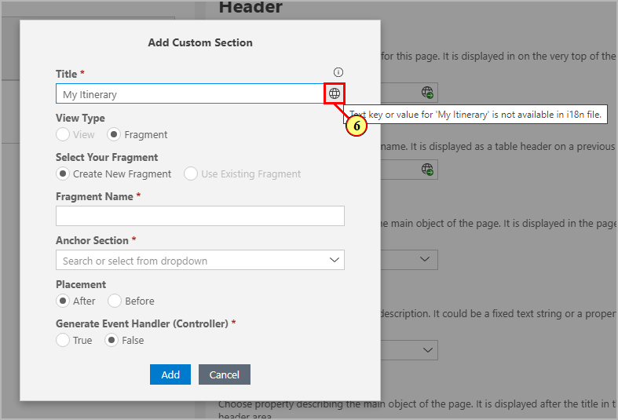

(7) In the dialog, click .

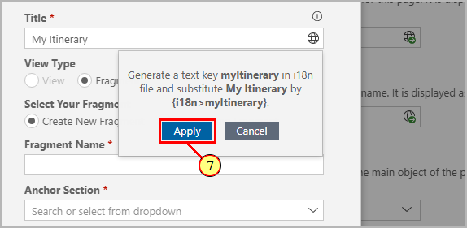

(8) Enter **CustomSection** as Fragment Name..

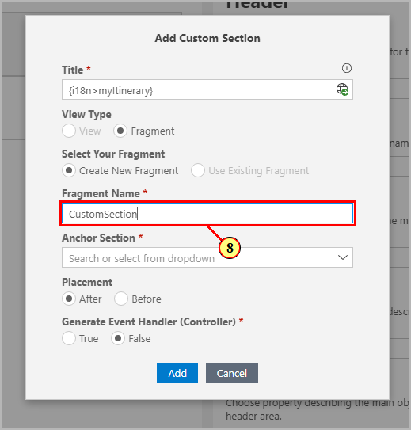

(9) Open the drop-down **Anchor Section**.

(10) Select .

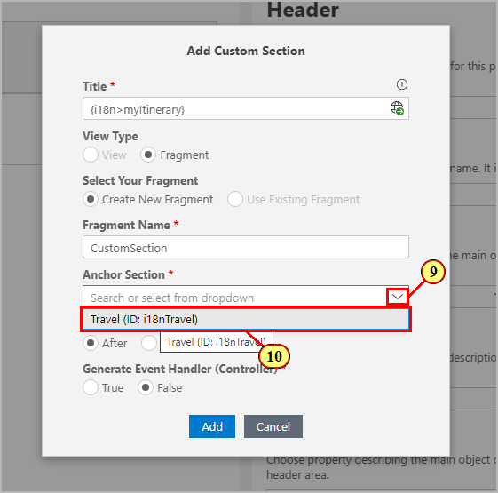

With the Section Position set to **After**, this defines where the custom section should be located on the Object Page.

(11) Set **Generate Event Handler (Controller)** to **true** and confirm dialog by clicking  **Add** (12).

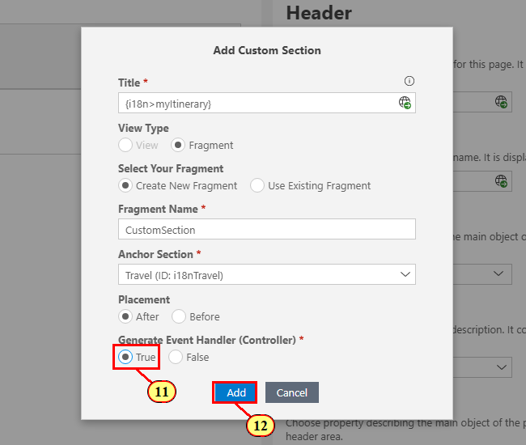

## Exercise 5.3 Use UI5 Language Assistant

(13) On section **My Itinerary**, click **Navigate to source code** .

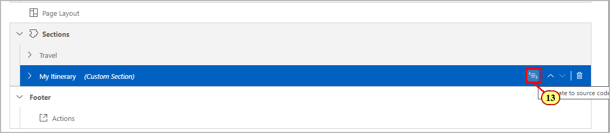

(14) This will open up generated file **CustomSection.fragment.xml**.

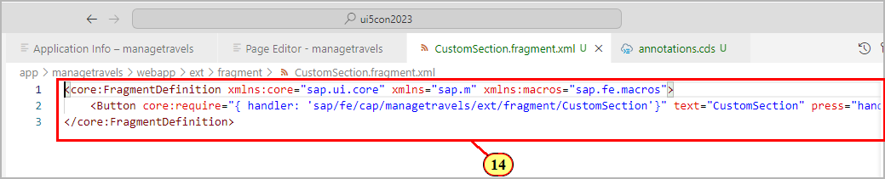

 Replace the content of file **CustomSection.fragment.xml** with the following xml snippet.

 ```js
<core:FragmentDefinition
  xmlns:core='sap.ui.core'
  xmlns='sap.m'
  xmlns:l='sap.ui.layout'
  xmlns:macros='sap.fe.macros'
>
 <VBox core:require="{handler: 'sap/fe/cap/managetravels/ext/fragment/CustomSection'}">  
  <MessageStrip
    text='All bookings for travel {TravelID} got confirmed by the agency.'
    showIcon='true'
    class='sapUiSmallMarginBottom'>
  </MessageStrip>     
  <l:Grid hSpacing='1' containerQuery='true'
    defaultSpan='L12 M12 S12'>
   <l:content>

   </l:content>
  </l:Grid>
 </VBox>
</core:FragmentDefinition>
```
The xml fragment contains a SAPUI5 MessageStrip control which we will now combine with **building block Table** from namespace **sap.fe.macros**.\
You can use **UI5 Language Assistant** extension for that purpose
which supports the XML modelling of building blocks.
- Place the cursor inside the **l:Content** section of the above entered code snippet and type in **<macros**.
- Activate language support by pressing keys ctrl+space (Mac OS: cmd+space) 
  and (15) select 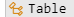 from namespace sap.fe.macros.

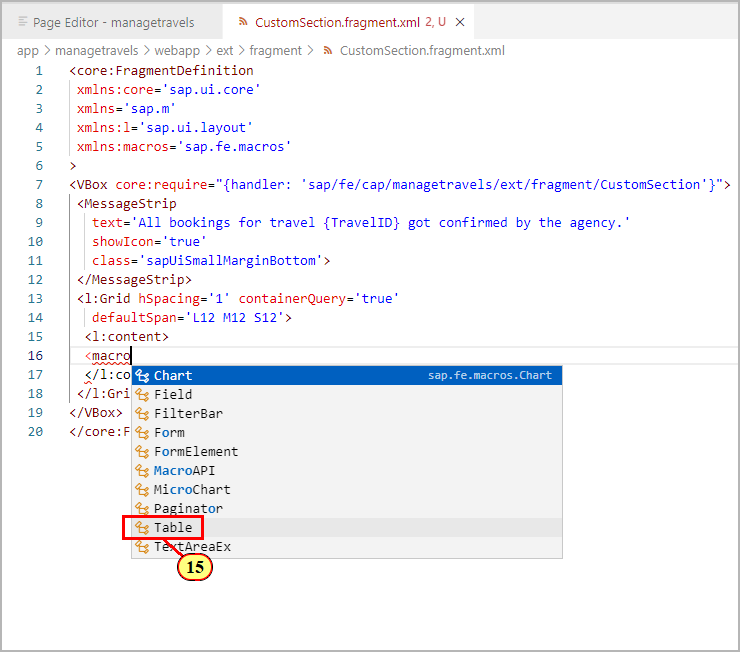

(16) Continue by adding property 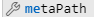.

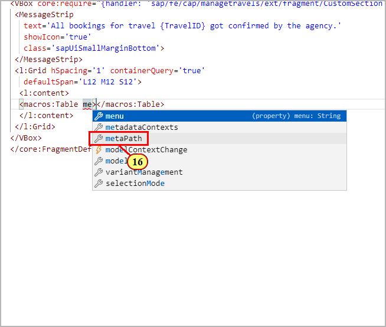

(17) Choose **navigation property to_Booking** as we need to define the relative path from the current page's context (entity **Travel**) to the **LineItem** annotation of the associated entity **Booking**.

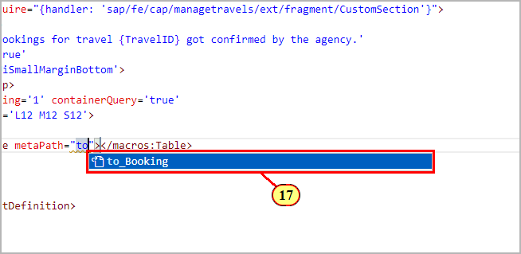

(18) Enter a **'/'** after the navigation property. UI5 Language Support will now propose the LineItem annotations available for metamodel context **to_Booking** (as defined for entity **Booking** in file **app/managetravels/annotations.cds**).\
Choose 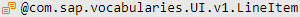.

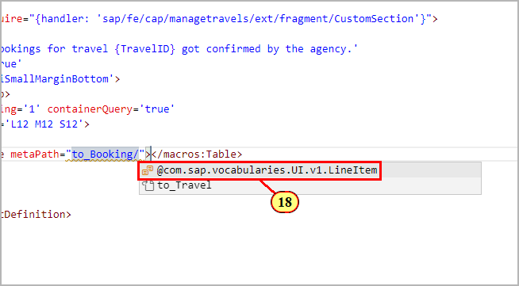

(19) Add the remaining property .

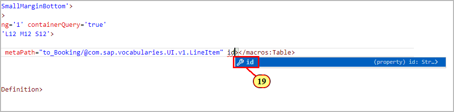

(20) Enter value **bookingTable** as unique identifier.

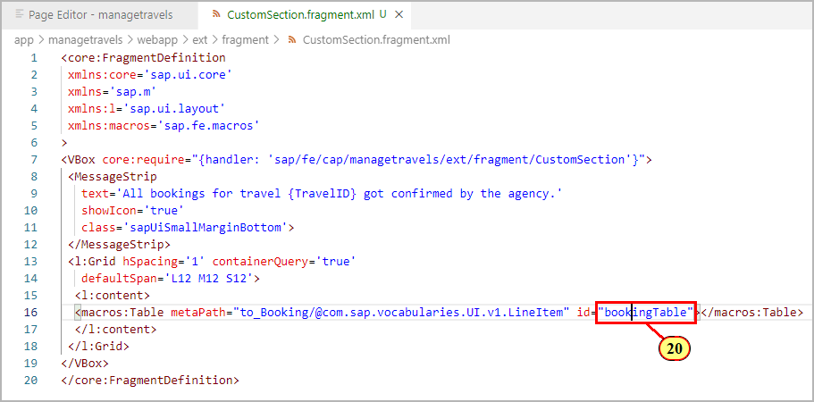

Switch back to the Page Editor. The added building block table is shown. You can select the different columns and manipulate their sequence and properties, just like in a standard table section.

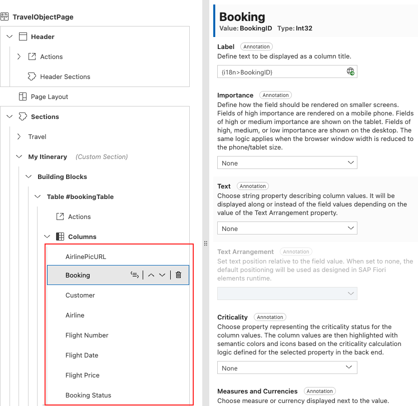

## Exercise 5.4 Testing the Table Building Block

Switch to the preview browser tab of the app.\
The object page now shows the custom section with the message strip control and table building block.\
We will now check whether it behaves exactly as the original booking table from the object page section that was replaced.

(21) Click .

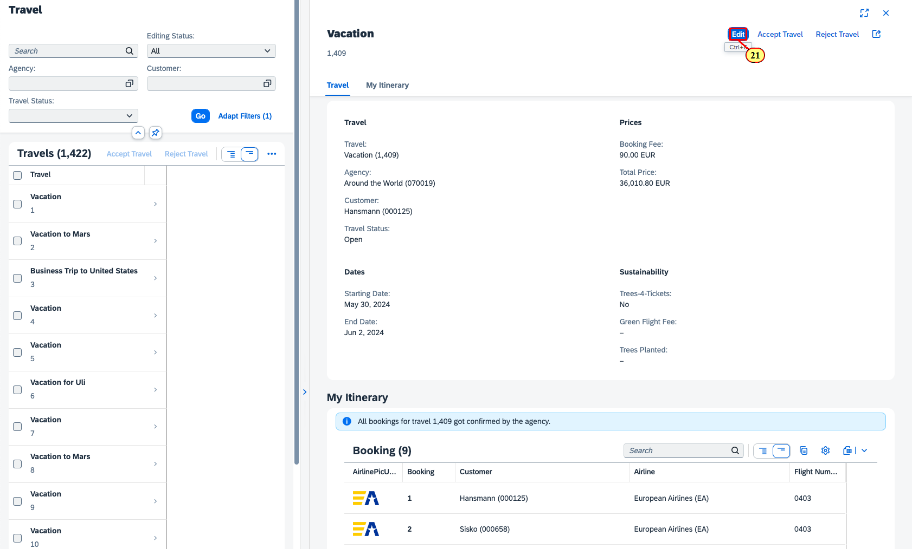

We can see that the table building block follows the edit state of the page.\
Let us check whether the edit flow is also working as expected.\
(22) Open the input help for field **Flight Number** by clicking .

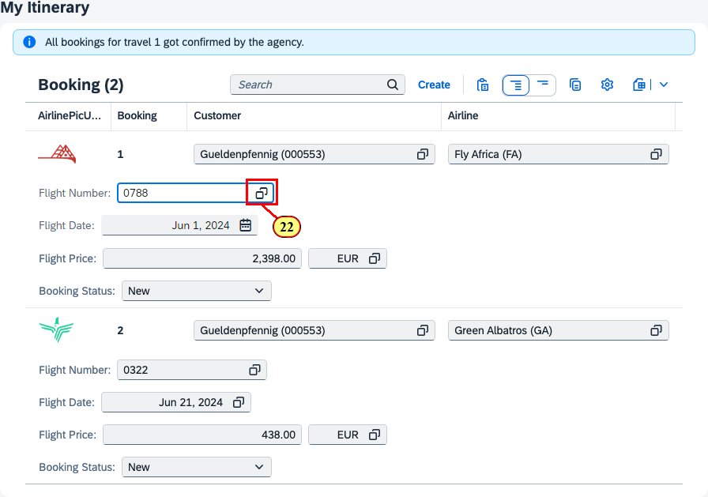

(23) In the Value Help dialog, Select a list entry.

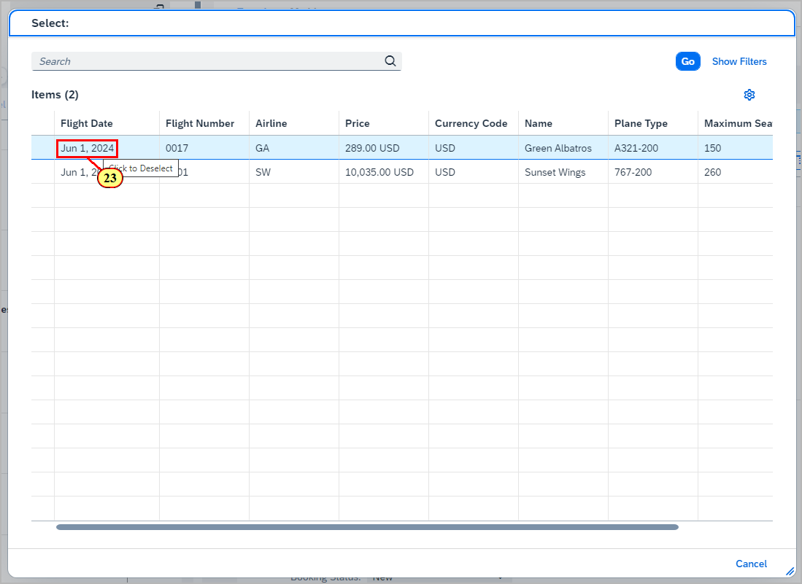

(24) In the footer bar, a notification shows that the draft has been automatically updated.

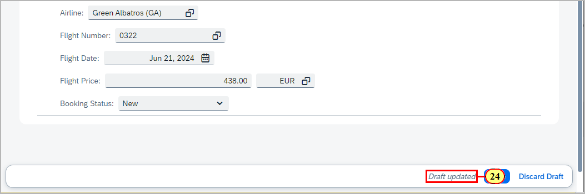

(25) Click .

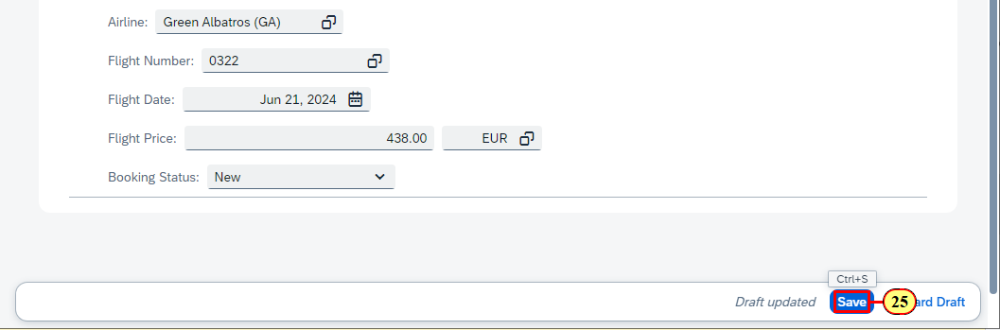

The table switches again to display mode, following the page's edit state.

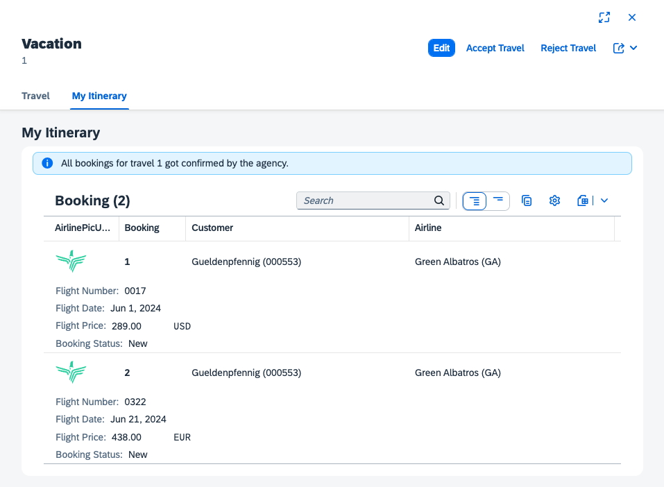

## Summary

You've now successfully added a custom section containing the table building block.

Continue to - [Exercise 6 - Page Map: Add Micro Chart Table Column](../ex6/README.md)