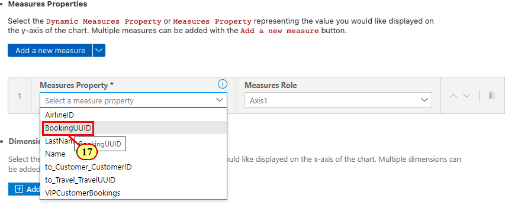

# Exercise 7 - Guided Development: Adding Building Block Chart

In this exercise, we will learn how to use **Guided Development** to add a **chart building block** to the object page custom section.
You will also learn how to implement the chart's selection event handler in order to show additional information on the UI.
The chart building block to be added to the custom section will show aggregated **bookings per customer for all airlines**, complementing the **Customer VIP Status**
scenario.\
File **db/Schema.cds** (1) contains view **BookedFlights** and an association to it in entity **Travel** (2) which we will use as data source for the chart.


In order for the chart to retrieve data, the service requires **oData V4 aggregate transformation capabilities**.\
In file **app/capabilities.cds** (3) you can find the corresponding **aggregation capabilities annotations** (4).


**Annotation explanation**:

- Collection **Transformations** lists all supported transformations for the entity container.
- Collection **GroupableProperties** contains the properties of the annotated entity that can be used in a **groupby** transformation.
- Collection **AggregatableProperties** contains the properties of the annotated entity that can be used for aggregation
- Collection **Analytics.AggregatedProperties** defines the aggregate expression with an aggregation method for the aggregatable property.

## Exercise 7.1 - Use Guided Development to Add Building Block Chart

(5) Click the **SAP Fiori** icon in the toolbar .

(6) In the **Application Modeller**, expand **Pages** and click .


(7) Expand the page hierarchy to Sections -> Custom Section **My Itinerary** -> **Building Blocks**.

(8) Click **Add** .


(9) Select .


(10) Click .


**Set the following property values**:

(11) **CDS File: app/managetravels/annotations.cds**

(12) **Service: TravelService**

(13) **Entity: BookedFlights**

(14) **Chart Qualifier: BookedFlights**

(15) **Chart Title: Bookings per Airline**.


(16) Click  to generate a text key. Confirm dialog by clicking .


(17) **Measures Entity Property**: .



(18) **Dimensions Entity Property**: .


(19) Click .


(20) **Second Dimensions Entity Property**: .


(21) For the second dimension **AirlineID**, switch **Dimension Role** to .


(22) Click .


(23) The annotation is applied to annotation file **app/managetravels/annotations.cds**.


The annotation defines the **chart type**, the **measure** and the **dimensions** to be used for visualization of the aggregated data.\
Property **BookingUUID** is defined as the **measure**.\
Properties **to_Customer_Customer_ID** and **AirlineID** are defined as the **grouping dimensions**.\
The aggregation result for the current Travel's bookings is enriched with aggregated bookings data for all other airlines.\
This is done in a custom handler in file **srv/travel-service.js**, section **Exercise 7: Custom Section Chart Building Block**.

(24) Move to step 2 of the development guide by clicking .


**Set the following property values**:

(25) **View or Fragment File**: .


(26) **Building Block ID**: **myChart**


(27) **Binding Context Path Type: Absolute**.


(28) **Service: TravelService**.

(29) **Entity: Travel**.

(30) **Navigation Path: to_BookedFlights**.


Using the absolute binding context path **/Travel/to_BookedFlights** allows to aggregate all bookings across all travels per airline and customer.

(31) **Chart Qualifier**: .


(32) **Aggregation Path**: .\
This defines the position in the XML Fragment where the reference to building block Chart is to be added.


(33) **Chart Personalization**: select **Type** and **Item**


(34) **Selection Change Function**: **handler.onChartSelectionChanged**\
We will implement the handler in the next exercise.


In the snippet preview pane, you can now check the properties defined for the building block Chart:

- **id** of the chart control
- **contextPath** defining the absolute path from root entity **Travel** and association **to_BookedFlights**
- **metaPath** defining the relative path to the UI.Chart annotation in the metamodel
- **personalization** for chart configuration options
- **selection mode** set to single selection

(35) Click .


(36) Click .


Open file **app/managetravels/webapp/ext/fragment/CustomSection.fragment.xml**.\
In the UI, the chart shall be shown next to the table in the same container, sharing the space mutually.

(37) Change the **default span** of the grid control to

```js
defaultSpan='L6 M6 S12'
```


(38) Switch the order of lines **macros:Chart** and **macros:Table** so that the Chart will be displayed to the left.


(39) Switch to the browser preview window. The chart is shown next to the table.


## Exercise 7.3: Implementing the Chart's Selection Change Handler

The **chart building block API** allows implementing a **selection change handler** which is triggered when a chart segment is selected.\
We will use the event to show additional information in a small popover.\
The **popover fragment sample** is provided in the project.\
We need to move it to the **app folder** in order to make usage of it.

 Open project folder **app/test-resources/ext/fragment**.\
 Drag and drop file **Popover.fragment.xml** (40) to folder **app/managetravels/webapp/ext/fragment** (41).


(42) Confirm dialog by clicking .


Now we need to add the Popover fragment as a dependent control to the Custom Sections grid control.\
(43) Open file **app/managetravels/webapp/ext/fragment/CustomSection.fragment.xml**

(44) Add the following xml snippet as shown in the screenshot below.

```js
  <l:dependents>
    <core:Fragment fragmentName="sap.fe.cap.managetravels.ext.fragment.Popover" type="XML"/>			
  </l:dependents>	
```


Now we need to implement the chart selection event handler.

(45) Open file **app/managetravels/webapp/ext/CustomSection.ts**.\
The file was created along with the custom section we added in exercise 6.\
(46) Replace the file content with the following code snippet.

```ts
interface paramType {
    data: object;
    target: object;
}

/**
 * @param this reference to the Fiori elements ExtensionAPI.
 * @param event the event object provided by the event provider
 */
export function onChartSelectionChanged(this: ExtensionAPI, event: UI5Event<Record<string, any>>) {
    if (event.getParameter("selected")) {
        //get element in the context of the custom section fragment
        //byId will be made public on the ExtensionAPI with SAPUI5 1.116.0
        const element = this.byId("myPopover");
        if (element instanceof Popover) {  
            let popupModel = element.getModel("popup") as JSONModel;
    
            if (!popupModel) {
                popupModel = new JSONModel();
                element.setModel(popupModel, "popup");
            }
            //Direct parameter access possible as chart is set to single selection mode
            const param = (event.getParameter("data") as [paramType])[0];
            popupModel.setData(param.data, true);
            // open popover at selected chart segment
            element.openBy(
                param.target as HTMLElement, true
            );
        }
    }
}
```


(47) Let's fix some TypeScript ESLint issues. Hover the mouse cursor over the syntax highlighted at **Popover** and click on .


(48) Select .


(49) (50) Apply another **Quick Fix** for **JSONModel**.


(51) Added imports are shown in the import section.


Exercise 7.4 Testing the Chart's Event Handler
Switch to the preview browser tab.
(52) Select a chart segment in order to display the popover with additional information about the VIP Customer program per airline.


We will now check for other flight connections for the customer's preferred airlines according to the aggregated bookings shown in the chart.

(53) Click .


In this example, customer **Gueldenpfennig (000553)** has a preference for  **Sunset Wings** which is shown with the most bookings to in the chart.\
Clicking (54) opens a dropdown list with flight connections for the same flight date.


(55) Select a list item for the customer's preferred airline.


(56) Click .


Verify that the both the chart (57) and the micro chart table column (58) have been updated.


We've now successfully added a @UI.Chart annotation to the service and added the **chart building block** to the custom section's XML fragment by using Guided Development.\
We've implemented the chart's **event handler** in Typescript in order to show a popover with additional information when a chart segment is selected.

Continue to - [Exercise 8 - Flexible Programming Model: Changing the Edit Flow by Implementing a Controller Extension](../ex8/README.md)