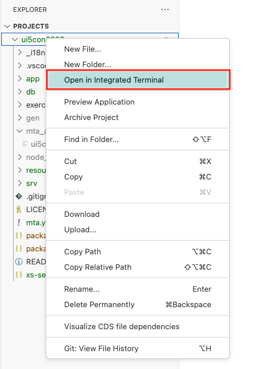
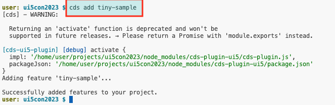
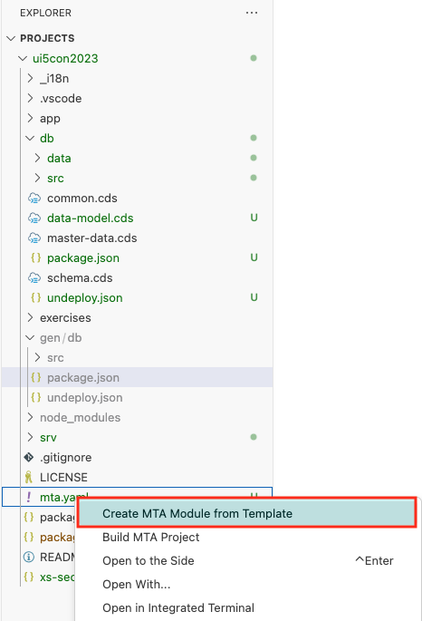

# Exercise 9 - Generate Multi Target Application configuration for Cloud Foundry Deployment using a Managed Approuter

In this exercise you will generate the deployment configuration using a managed approuter, supporting a SAP HANA database.

## Exercise 9.1 - Add Sample Data

(1) Open a terminal window, from the root of your CAP project, right-click your project and select `Open in Integrated Terminal`;



(2) In the new terminal window, run the command;

```bash
cds add tiny-sample
```



## Exercise 9.2 - Add a Multi Target Application configuration

(3) In the terminal window,  run the command;

```bash
cds add mta
```


The following files are now added to your project;

* mta.yaml
* xs-security.json

## Exercise 9.3 - Build CDS sources for HANA deployment

(4) In the terminal window,  run the command;

```bash
cds build --for hana
```


This is generates a `package.json` that is required for the database deployment, so lets copy that into the `db` folder;

(5) In the terminal window,  run the command;

```bash
cp gen/db/package.json db
```


## Exercise 9.4 - Add Managed Approuter Configuration

(6) Right click `mta.yaml`, select `Create MTA Module from Template`;



(7) A new tab opens, select `Approuter Configuration`, then select `Start`;


(8) Ensure `Managed Approuter` is selected as the HTML5 application runtime. Enter a unique name, for example `ui5con2024` and select `Next`.


(9) Since the `xs-security.json` was already created in a previous step, the wizard will ask you for an `Action`. Assuming, you havent touched the `xs-security.json`, select `overwrite` to apply the default settings, then select `Finish` to complete the task.


The `mta.yaml` is now updated with a managed approuter configuration.

## Exercise 9.5 - Validate your configuration

(10) As it stands, `package.json` does not contain any build scripts! These will be added in another step! For the moment, you need to right click `mta.yaml` and select `Build MTA Project`;


## Summary

You've now successfully created an MTA archive using a managed approuter configuration that is ready for deployment!

Continue to - [Exercise 10 - Add Fiori UI application to MTA Configuration](../ex10/README.md)

